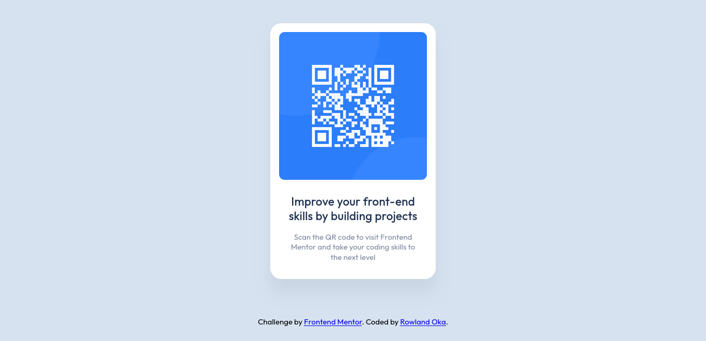

# Frontend Mentor - QR code component solution

This is a solution to the [QR code component challenge on Frontend Mentor](https://www.frontendmentor.io/challenges/qr-code-component-iux_sIO_H). Frontend Mentor challenges help you improve your coding skills by building realistic projects.

## Table of contents

- [Overview](#overview)
  - [Screenshot](#screenshot)
  - [Links](#links)
  - [Built with](#HTML-CSS)
  - [What I learned](#what-i-learned)
- [Author](#ROWLAND-OKA)

## Overview

### Screenshot

### Links

- Solution URL: [https://github.com/Rowlandoka/qr-component]
- Live Site URL: [https://rowlandoka.github.io/qr-component/]

## My process

### Built with

- Semantic HTML5 markup
- CSS Variables
- CSS Grid
- Mobile-first workflow

### What I learned

In building this component, I learned how to use HTML elements and CSS variables to style and add dynamic colors to HTML elements, how to use CSS Grid to aligned and position element

## Author

- Website - [Rowland Oka](https://rowlandoka.github.io/raydev-site/)
- Frontend Mentor - [@Rowlandoka](https://www.frontendmentor.io/profile/Rowlandoka)
- Twitter - [@EdodiRowland](https://www.twitter.com/EdodiRowland)
